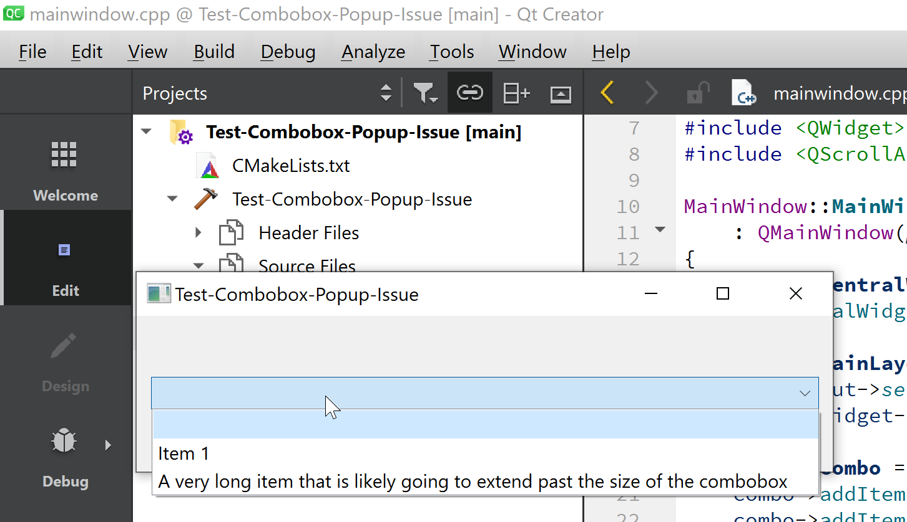
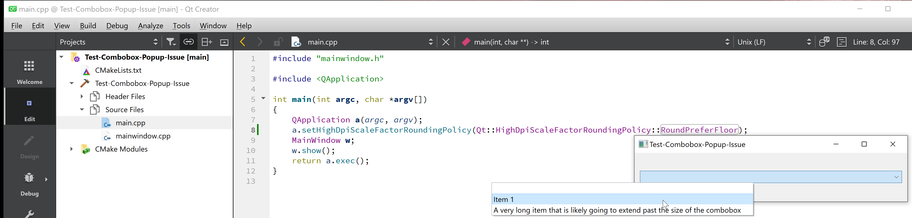
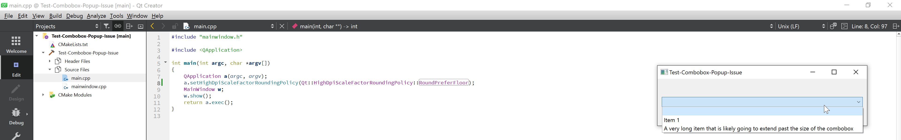

# Combobox popup position issue

* Windows 10 21H2
* High DPI display
* Set Display Scaling to 250% (fractional)
* Move the main window to the left of the screen: popup is ok

* Move the main window to the right of the screen: it gets an offset that gets worse and worse

* Now try with 200% scaling: it works fine

Note: if I start the application at 200%, then switch to 250% while it's running, then it works fine
